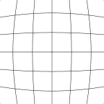
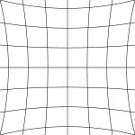
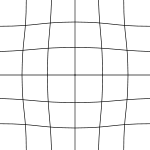

# 相机校准

## 目标

了解畸变的类型

了解透视原理

了解摄影测量中的误差来源

掌握在 matlab 中矫正畸变的方法

了解 matlab 图片矩阵的坐标

掌握图片坐标和实际坐标的转换方法

## 内容

### 畸变

畸变是一种由镜头引起的像差，有三种类型：桶型畸变、枕型畸变和复合畸变，如下图

桶型畸变 

枕型畸变 

复合畸变 

### 透视原理

透视原理可以概括为“近大远小”。照片是三维空间的二维投影，单张照片无法测量出一个空间点的三维坐标，要想测量三维坐标必须使用多个机位、多张照片。本课程只考虑摄影测量中最简单的情形——用单张照片测量一个已知平面上的几何参数。

### 摄影测量中的误差来源

影像本身的分辨率（光学分辨率、数码分辨率）、畸变、透视（如俯仰误差）。

### 在 matlab 中矫正畸变

阅读文档《Single Camera Calibration》。

重投影误差的概念，利用重投影误差评估矫正效果，阅读文档《Evaluating the Accuracy of Single Camera Calibration》。

### matlab 图像矩阵的坐标

阅读文档《Image Coordinate Systems》。上面用到的 estimateCameraParameters 可以在矫正畸变的同时建立图片坐标和实际坐标的关系。

## 家庭作业

阅读维基百科 [Distortion (optics)](https://en.wikipedia.org/wiki/Distortion_(optics))

用本课程提供的四幅图校准相机，图中一个格子的尺寸是 100 mm。计算 2.png 中 checkerboard 的尺寸（含白色边框）。
